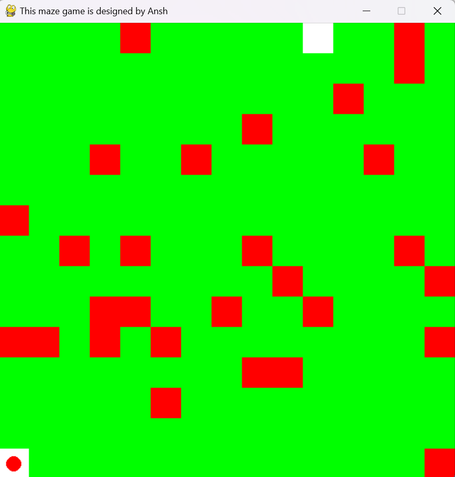
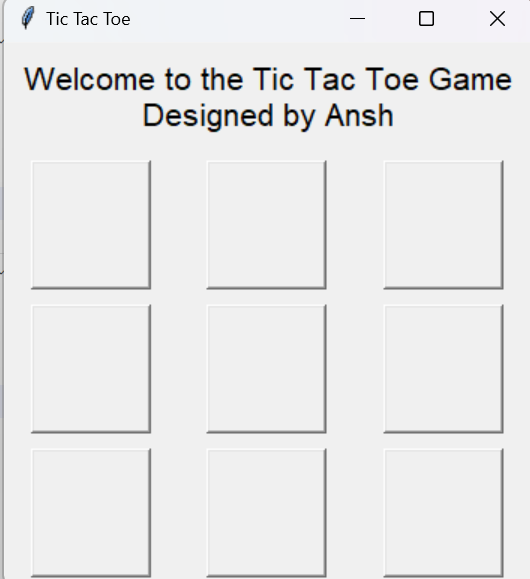

# 🎮 Python Game Collection

## 🏆 Maze Game (Pygame, NumPy, Random)
### Description
A fun and interactive **Maze Game** built using Python and **Pygame**. The player navigates through a randomly generated maze to reach the goal!

### 🖼️ Maze Game Screenshot
()


### 🚀 Features
- **Randomly generated mazes** for unique gameplay every time
- **Player movement controls** using keyboard arrow keys
- **Smooth animations** using Pygame

### 📦 Requirements
Make sure you have the required libraries installed:
```bash
pip install pygame numpy
```

### 🕹️ How to Play
1. Run the game using:
   ```bash
   python maze_game.py
   ```
2. Use arrow keys to navigate the maze.
3. Reach the goal to win!

---

## ❌⭕ Tic-Tac-Toe Game (Tkinter)
### Description
A simple **Tic-Tac-Toe Game** built using Python and **Tkinter** for the GUI.


### 🖼️ Tic-Tac-Toe Screenshot
()


### 🚀 Features
- **Interactive UI** built with Tkinter
- **Two-player mode**
- **Win detection logic** to determine the winner

### 📦 Requirements
Ensure you have Tkinter installed (comes pre-installed with Python).

### 🕹️ How to Play
1. Run the game using:
   ```bash
   python tic_tac_toe.py
   ```
2. Players take turns selecting a grid cell.
3. The first player to get three marks in a row, column, or diagonal wins!

---

## 📜 License
This project is open-source and free to use!

---

👨‍💻 Developed by **Ansh Shukla**
